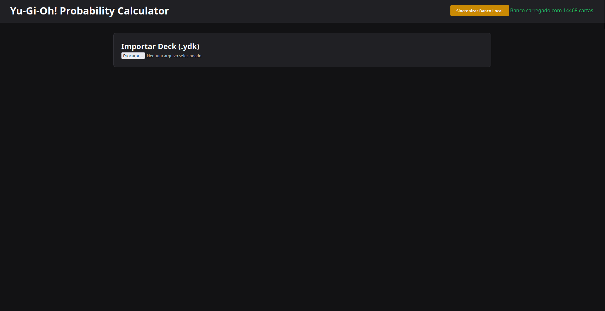
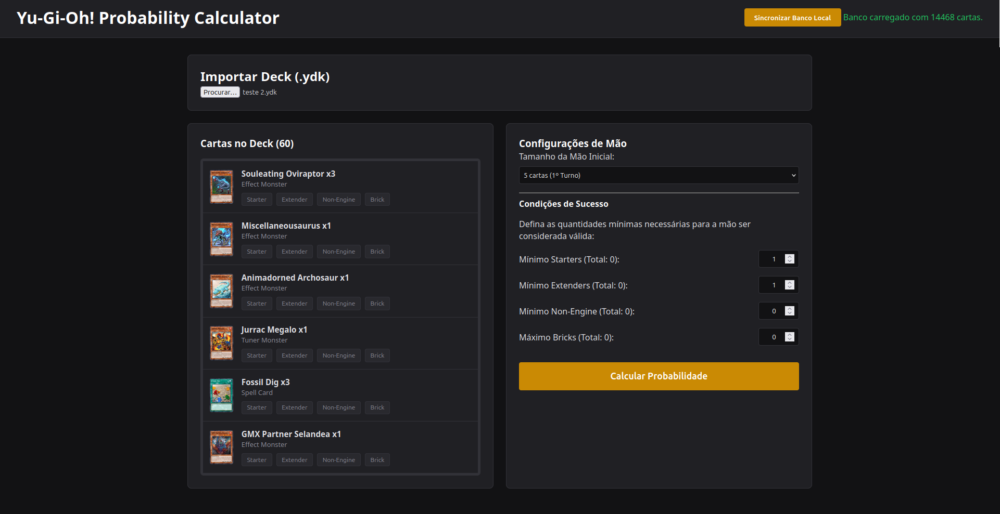
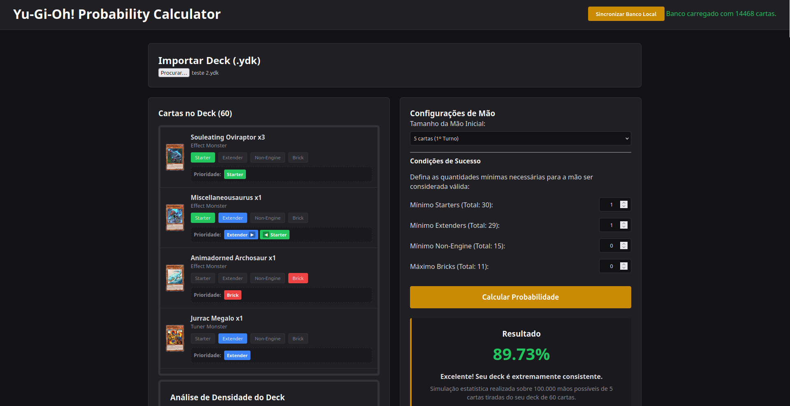
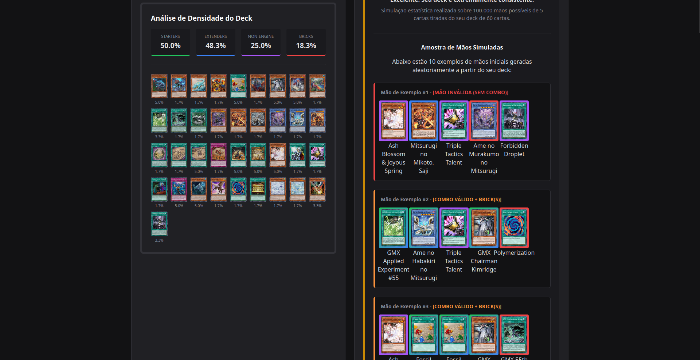

# Yu-Gi-Oh! Probability Calculator

A high-performance tool designed for Yu-Gi-Oh! deck building, focusing on statistical analysis of hand consistency. The application allows players to classify cards as Starters, Extenders, Non-Engine, or Bricks, providing detailed insights into opening hand probability and deck density.

---

## Architecture and Performance

To handle the complexity of Yu-Gi-Oh! deck analysis and simulate thousands of scenarios efficiently, the project adopts a local-first hybrid architecture:

- **Local Backend (Node.js + Express):** Acts as an intelligent data manager. Upon startup, it handles card database synchronization, filtering unnecessary properties to ensure the frontend remains lightweight and responsive.
- **Front-end (Vanilla JS + CSS):** A fast, CSS-grid-based interface that provides real-time feedback and dynamic categorization.
- **Monte Carlo Simulation:** The core engine runs 100,000 hand simulations to determine statistical consistency, allowing users to define specific constraints for what constitutes a "successful" opening hand.
- **Visual Density Dashboard:** Uses grid-based layouts to instantly show the percentage distribution of card categories, helping players identify potential "brick" issues or lack of "starters" at a glance.

---

Initial Screen


.YDK loaded


Probability Calculated


Desity and Hands Conainers


---

## Repository Structure

```text
YU-GI-OH_PROBABILITY_CALCULATOR/
├── assets/
│   ├── cache-images/      # Local proxy cache for card images
│   └── data/              # JSON database of Yu-Gi-Oh! cards
|
├── public/
│   └── js/                # Frontend modular scripts
│       ├── api.js         # Backend communication module
│       ├── calc.js        # Probability and simulation algorithms
│       ├── main.js        # Main application entry point
│       ├── ui.js          # DOM manipulation and visual feedback
│       └── ydk.js         # YDK deck file parsing logic
|
│   ├── i18n.js            # Internationalization (i18n) settings
│   ├── index.html         # Main user interface
│   └── style.css          # Styling and dynamic theme assets
|
├── server.js              # Node.js Express backend API
├── .gitignore             # Git exclusion rules
├── package.json           # Dependencies and project metadata
├── LICENSE                # Project license information
└── README.md              # Project documentation
``` 

---

## How to Run Locally
Prerequisites:

  - Node.js (Latest stable version)
  - A local static server (e.g., Live Server extension for VS Code)

---

## Setup Steps

### 1: Install Dependencies:

Open your terminal in the project root and run:

```text
  npm install
```
---
### 2: Start the Backend Server:

Start the local API to enable database management:

```text
node server.js
```

The terminal will confirm: Backend server running at http://localhost:3000.
---
### 3: Launch the Frontend:

  Open index.html using your Live Server extension (usually running at http://127.0.0.1:5500).
  Deck Synchronization
  
---
##The application allows for seamless updates as your card database grows:

    Sync Database: Click the "Sincronizar Banco Local" button in the header.
    Dynamic Updates: The frontend sends a POST request to server.js, which fetches the latest card data from the backend, ensuring your calculations are always based on the most recent pool.

License

This project is licensed under the MIT License. See the LICENSE file for details.
